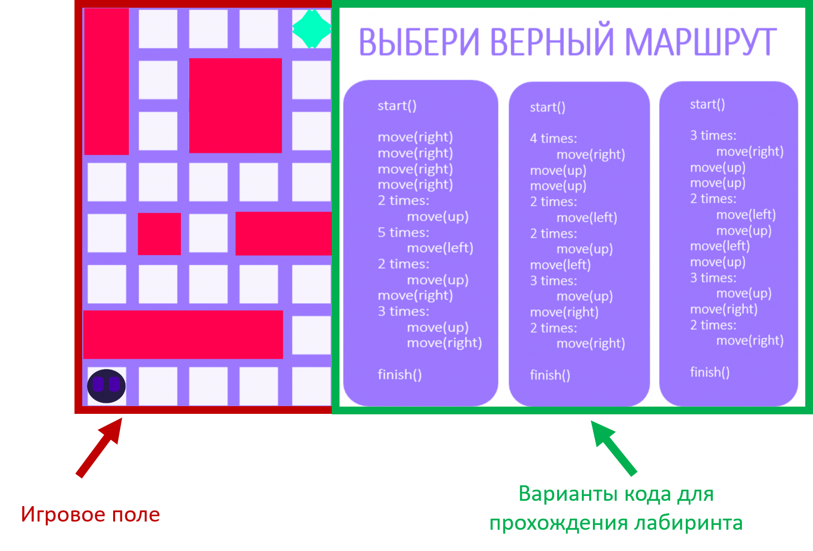

<h1>Проект "INNOPROG Game"</h1>

Добро пожаловать в репозиторий проекта "INNOPROG Game"! [Краткое описание проекта]

<h2>О проекте</h2>

В данном репозитории находится исходный код сайта, бота в Telegram, видео с кодом, презентация и изображения, связанные с нашей интересной и захватывающей игрой.

<h2>Скриншоты</h2>
<h3>Главная страница:</h3>

<h3>Игра:</h3>

<h3>После успешного прохождения игры вам будет предоставлена скидка на курс от INNOPROG, которая станет доступна после регистрации.</h3>

<h2>Особенности проекта</h2>
<ul>
  <li>После успешного прохождения игры вы получите специальную скидку на курс от INNOPROG, которая станет доступна после регистрации.</li>
  <li>Получите 10% скидку на нашем сайте, авторизовавшись на нем.</li>
  <li>Мы обеспечиваем высокий уровень безопасности. В нашей базе данных пароли хранятся в хеше, который может быть расшифрован только той системой, которая его зашифровала.</li>
</ul>

<h2>Контакты</h2>

Если у вас возникли вопросы или предложения, пожалуйста, свяжитесь с нами:

<ul>
  <li>Email: whaile@whaile.ru</li>
  <li>Telegram: @whaile_off_3</li>
</ul>

Мы рады сотрудничеству и готовы ответить на все ваши вопросы!

